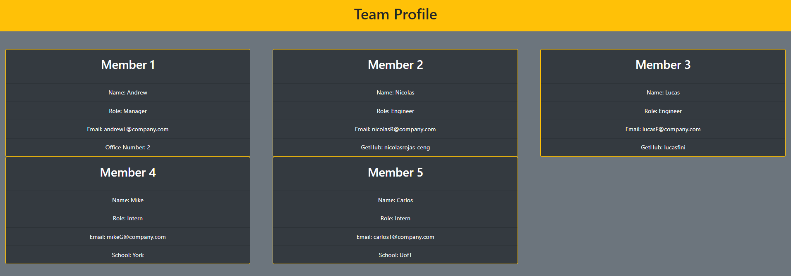

# Team Profile Generator
Project 8. Due date: 6th of March 2022.
## Table of Contents

* [Goal of the Project](#Goal)
* [Story of the Project](#Story)
* [Description of the Project](#Description)
* [Install Instructions](#Installation)
* [Project License](#License)
* [Usage Instructions](#Usage)
* [Criteria For Completion](#Criteria)
* [Steps For Completion](#Completion)
* [Site/App Preview](#Preview)
* [Questions](#Questions)

# <a name="Goal"> Goal of the Project </a>
To create a simple application to generate a team profile website.
# <a name="Story"> Story of the Project </a>
As a manager, I want to generate a webpage that displays my team's basic infoso that I have quick access to their emails and GitHub profiles.
# <a name="Description"> Description of the Project </a>
An application for the creation of custom Team Profiles for any company. The app has three different employee profiles, Manager, Engineer, and Intern.
# <a name="Installation"> Install Instructions </a>
Run a terminal window within the project file, and write the following command "npm install" or "npm i".
# <a name="License"> Project License </a>
This project does not have a license.
# <a name="Usage"> Usage Instructions </a>
Read the instructions at the beginning. Then you can simply answer the prompts based on what type of employee you want to add.
# <a name="Criteria"> Criteria For Completion </a>
1. The app begins with the prompts to create a manager's profile.
2. The app prompts for the addition of an Intern profile, Engineer profile, or None.
3. When Intern is selected, the prompts for the intern's profile are displyed.
4. When Engineer is selected, the prompts for the engineer's profile are displyed.
5. When None is selected, the app terminates and the HTML file is created.
6. Emails on team cards opens the default mailing program.
7. GitHub user section of the cards opens a new tab to the employee's github profile.
# <a name="Completion"> Steps For Completion </a>
- Created the different classes
   - Created the base Employee classes
   - Created the Manager, Engineer, Intern classes based on the Employee class.
   - Created tests for all classes.
- Added the logic for the prompts.
   - Not implemented the way the acceptance criteria wanted.
- Added the logic for the file creation.
   - Created the layout for the html file.
   - Refactored some code.
- Changed the prompts to better fit with the acceptance criteria.
- Added documentation and ReadMe.
# <a name="Preview"> Site/App Preview </a>

Team Profile Creation:

https://user-images.githubusercontent.com/55503463/155903990-22b06e20-4b2a-4cb0-aa65-6d3cff344301.mp4

Tests:

https://user-images.githubusercontent.com/55503463/155904044-829734d5-3e6f-4ea7-8be3-0518653382d2.mp4

Profile Validation:

https://user-images.githubusercontent.com/55503463/155904049-fdd5426b-7430-4347-a0e5-110fabffa6eb.mp4

Exiting App:

https://user-images.githubusercontent.com/55503463/155904064-f1b5229d-d514-4916-8a03-4b25386f8044.mp4

# <a name="Questions"> Questions </a>
  If you have any questions, feel free to contact me through GitHub at
  [nicolasrojas-ceng](https://github.com/nicolasrojas-ceng).  
  Alternatively, you can contact me at my email: [lucanrojas@gmail.com](mailto:lucanrojas@gmail.com)
